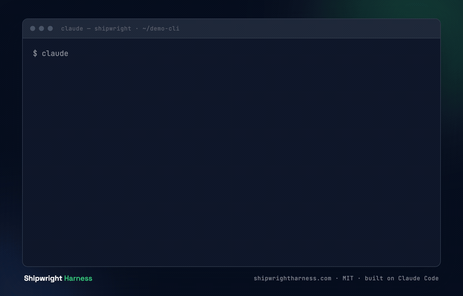

# Shipwright Harness

[](https://github.com/app-vitals/shipwright/releases)
[](./LICENSE)
[](https://www.anthropic.com/claude-code)

**The open-source autonomous delivery agent for Claude Code.** A deployable cloud agent and the autonomous coding system that powers it — built on the Shipwright plugin, running on your own codebase.

<p align="center">
  
  <br />
  <em>Plan → build → review → ship — one task through the pipeline. (Illustrative.)</em>
</p>

> 🚧 **Early development.** You can already run the **metrics dashboard locally today** — see [Quickstart](#quickstart) for the one-prompt setup (offline by default, no accounts or secrets). The hosted **Shipwright agent** (Phase C) and parts of the plugin (Phase A) are still being built and aren't ready for general installation yet. Follow progress in the [issues](https://github.com/app-vitals/shipwright/issues).

> **Brand vs. package:** the project is **Shipwright Harness**; the plugin/package you install is **`shipwright`**.

## Install

```text
/plugin install shipwright@app-vitals/shipwright
```

Requires [Claude Code](https://www.anthropic.com/claude-code). Point it at your own repository — Shipwright is repo-agnostic.

**Deploying the services to Kubernetes?** The `shipwright` Helm chart is published to a Helm repo on each chart version bump:

```bash
helm repo add shipwright https://app-vitals.github.io/shipwright
helm install my-release shipwright/shipwright --namespace shipwright --create-namespace
```

See [`docs/deploy-kubernetes.md`](./docs/deploy-kubernetes.md) for end-to-end deployment guides (Minikube / GKE / EKS), and [`docs/helm-repo.md`](./docs/helm-repo.md) for the published-repo flow and how publishing is triggered.

## Quickstart

You can run the **metrics dashboard locally today** — **offline by default**, with **no PostHog key, no accounts, and no database**. One copy-paste prompt sequences the two execution contexts (terminal shell + an in-session slash command) and opens the dashboard.

Paste this into a **Claude Code** session:

```text
Set up Shipwright Harness locally and open the metrics dashboard.

1. In a terminal, run:
     git clone https://github.com/app-vitals/shipwright.git && cd shipwright && ./scripts/quickstart.sh
   This checks prerequisites, installs dependencies (task setup), and starts the
   metrics dashboard in offline mode (no accounts or secrets needed). Leave it running.

2. Inside this Claude Code session, install the plugin:
     /plugin install shipwright@app-vitals/shipwright

3. Open the dashboard in your browser:
     http://localhost:3460/dashboard
```

Step 1 runs in your **terminal**; step 2 is a slash command that runs **inside the Claude Code session**. The dashboard comes up at <http://localhost:3460/dashboard>.

Prerequisites: [Claude Code](https://www.anthropic.com/claude-code), [git](https://git-scm.com/downloads), [Bun](https://bun.sh), and [go-task](https://taskfile.dev/installation/). Full details, the `QUICKSTART_SKIP_SERVE` CI guard, and the offline-default explanation live in [`docs/quickstart.md`](./docs/quickstart.md).

## What is Shipwright Harness?

Two faces, one product:

- **The agent** — deploy it to your cloud (GitHub Actions or self-hosted). It does autonomous coding on your codebase, held to the **same review and test bar as human code**.
- **The system** — the autonomous coding system, built on the Claude Code **`shipwright` plugin**: plan · build · review · metrics. Use it interactively inside Claude Code, or let the agent run it autonomously.

It runs in **your** environment, on **your** codebase — you own it, it's MIT, and it's free.

## What it does

Shipwright turns a feature idea into shipped, reviewed code through a sequence of Claude Code commands — each stage producing a durable artifact the next stage consumes:

- **PRD** an idea into a product spec.
- **Plan** the spec into a queue of well-scoped, dependency-ordered tasks (tracked as **GitHub Issues** — the queue lives where your team already works).
- **Execute** the next ready task — build, test, and open a PR.
- **Review** the PR with policy-controlled, inline feedback.
- **Ship** the merged change.

## Why Shipwright Harness

- **Free and open-source (MIT)** — the own-it alternative to closed, hosted coding agents. No rented infrastructure, no lock-in.
- **Runs in your environment, your cloud** — your code never leaves your control.
- **The same quality bar as human code** — tests land with the code, gated by a five-phase **test-readiness** pipeline, so an autonomous agent can be trusted.
- **Metrics on your own pipeline** — first-time-quality rate, estimation accuracy, and review-verdict trends, measured on your delivery.
- **Built on Claude Code** — we use it every day, and Shipwright extends it rather than replacing it.

## Components

| Component | What it does | Status |
|---|---|---|
| **Plugin (the system)** | The `shipwright` toolchain you `/plugin install` — planning, queue-based execution, review, a test-readiness pipeline, and deploy commands. | 🔨 Building (Phase A) |
| **Metrics dashboard** | A stateless service that reads pipeline analytics (task throughput, CI first-pass rate, review verdicts, estimation accuracy) and renders a dashboard. Run locally with `task api` or `task ui` (offline mode, no secrets needed). | 🔨 Building (Phase B) |
| **Shipwright agent** | A thin autonomous runner that drives the system on a schedule — pick the next ready task → build → ship a PR → forward metrics — deployable to GitHub Actions or self-hosted. | 📋 Planned (Phase C) |

## The workflow

```
/shipwright:prd            → a product spec
/shipwright:plan-session   → a dependency-ordered task queue
/shipwright:dev-task       → build + test + open a PR for the next ready task
/shipwright:review         → policy-controlled PR review
/shipwright:patch          → address review findings / failing CI
/shipwright:deploy         → merge + deploy
```

Tasks are tracked as GitHub Issues, so the queue lives where your team already works.

## Project status

Shipwright Harness is being assembled here in three phases — plugin, then metrics dashboard, then Shipwright agent — with merge-blocking CI gates and a single local task runner from the start. See the [`shipwright-oss` milestone](https://github.com/app-vitals/shipwright/milestones) and the [issues](https://github.com/app-vitals/shipwright/issues) for the live roadmap.

The metrics dashboard is runnable locally today — the [Quickstart](#quickstart) wraps this in one copy-paste prompt (`./scripts/quickstart.sh`). The underlying tasks:

```bash
task setup      # bun install
task api        # start metrics dashboard in offline mode → http://localhost:3460/dashboard
task dev        # dev supervisor: starts metrics + Ctrl-C kills all children
task stack      # full dev stack in a tmux session (4 panes) — requires tmux
```

`task stack` brings up a single tmux session (`shipwright`) with a 4-pane dashboard: **metrics** (offline SQLite, :3460), the **agent** with the dev `/chat` endpoint enabled (:3000), the **chat** REPL, and a scratch **logs** shell. It runs a Prisma `migrate deploy` preflight first so the agent's local SQLite DB exists, then a chat message drives real agent work whose events surface on the local dashboard. `task stack` requires `tmux`; if it isn't installed, use `task dev` (the no-tmux fallback that starts the metrics dashboard).

See [`docs/quickstart.md`](./docs/quickstart.md) for the full onboarding prompt and offline-default behavior.

## Built on Claude Code

Shipwright Harness is a [Claude Code](https://www.anthropic.com/claude-code) plugin through and through — built on it, for it, and used with it daily. If you already run Claude Code, Shipwright is a `/plugin install` away.

## Test system

Shipwright enforces a four-layer test architecture (unit / integration / smoke / e2e) across all three components. Layer boundaries, per-component run commands, speed budgets, and the test-isolation contract are defined in [`docs/test-readiness/test-system.md`](./docs/test-readiness/test-system.md).

## Configuration

All configuration options — plugin env vars, `.shipwright.json` keys, agent env vars, and policy fields — are documented in [`docs/configuration.md`](./docs/configuration.md).

## Contributing

Issues and discussion are welcome. See [`CONTRIBUTING.md`](./CONTRIBUTING.md) for conventions and workflow, and our [`CODE_OF_CONDUCT.md`](./CODE_OF_CONDUCT.md). This repository is MIT-licensed and public — please keep contributions free of any proprietary or confidential material.

## License

[MIT](./LICENSE) © 2026 App Vitals
